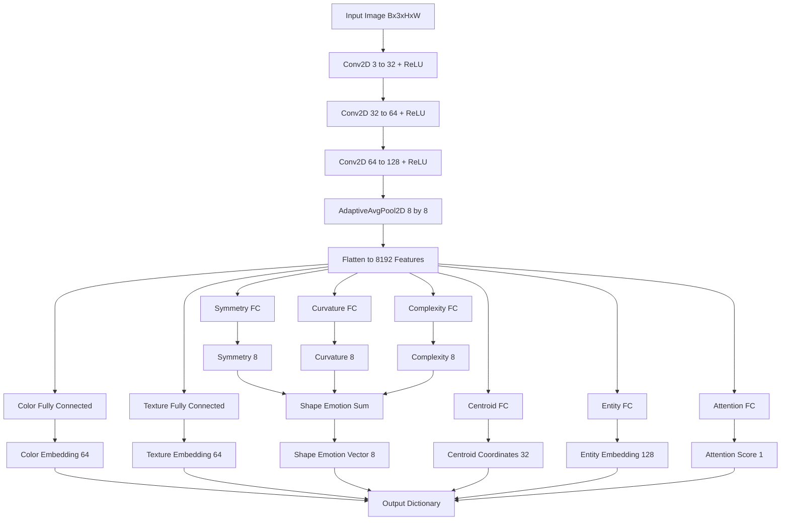

# VisualCortexBENN
The Visual Cortex BENN(Biologically-inspired Emotional Neural Network) is a Python-based software project developed by Angela Louise Trainor. It is a machine learning model designed to identify, discern, and recreate different images at a rate faster than other learning models by utilizing an emotionally based learning algorithm that closely mimicks the actual neuron firing pattern to, within, and from the visual cortex within the human brain. 

## Features

- Convolutional Feature Extraction (V1–V3 simulation)
- Color & Texture Embeddings
- Shape Emotion Mapping (symmetry, curvature, complexity)
- Centroid Estimation for spatial reasoning
- Entity Embeddings for classification or retrieval
- Attention Gating for relevance filtering
- Fully trainable with a generic Trainer class
- Supports validation and accuracy tracking

## Data Flow Diagram



## Requirements - Python 3.8+
- PyTorch >= 2.0
- TorchVision
***Install dependencies:***
  bash
  pip install torch torchvision

**Getting Started**
Follow these steps to quickly run and train
VisualCortexBENN from GitHub:

### 1. Clone the Repository
git clone https://github.com/<UnhingedNuke>/
VisualCortexBENN.git
cd VisualCortexBENN
### 2. Install Dependencies
pip install -r requirements.txt

### 3. Run Built-in Tests
The model includes unit tests or fallback testing:
python visual_cortex_ben.py
Verifies forward pass, output shapes, and gradients.

### 4. Prepare Training Data

**Use a built-in dataset or your own:**

    from torchvision import datasets, transforms
    transform = transforms.Compose([transforms.Resize((64,64)), transforms.ToTensor()])
    train_dataset = datasets.CIFAR10(root="./data", train=True, download=True, transform=transform)
    val_dataset = datasets.CIFAR10(root="./data", train=False, download=True, transform=transform)
    
**For custom datasets:**

    from torchvision.datasets import ImageFolder
    custom_dataset = ImageFolder(root="./my_images", transform=transforms.Compose([transforms.Resize((64,64)), ]))
                             
### 5. Train the Model

    transforms.ToTensor()
    from visual_cortex_ben import VisualCortexBENN, Trainer
    model = VisualCortexBENN()
    trainer = Trainer(model, classifier_out=10)
    trainer.train(train_dataset, val_dataset=val_dataset, epochs=3, batch_size=32)

Although the train and generate files are not currently available, they are not difficult to generate and create.


## Concept Reference

VisualCortexBENN is inspired by the human visual cortex,
with layered processing similar to V1–V3 areas.
For detailed explanation, see the PDF:
[Visual Cortex-inspired Neural Network Design](./docs/
VisualCortexBENN_Concept.pdf)

## Research Papers

The following independent research papers provide additional background,
methodology, and theoretical context related to this project.

- **The BENN Architecture: An Exploration of Biologically-Inspired Emotional Neural Networks**  
  Short description of what the paper covers and how it relates to the project.  
  [Read the paper](https://github.com/UnhingedNuke/VisualCortexBENN/blob/main/docs/research/The%20BENN%20Architecture-%20An%20Exploration%20of%20Biologically-Inspired%20Emotional%20Neural%20Networks.pdf)

- **Neuro-Symbolic Visual Perception: A Modular Visual Cortex–Inspired Embedding Network for Photographic Intelligence**  
  Brief explanation of what the structuring of the model theoretically entails in comparison to other models.
  [Read the paper](https://github.com/UnhingedNuke/VisualCortexBENN/blob/main/docs/research/Neuro-Symbolic%20Visual%20Perception-%20A%20Breakdown%20of%20BENN%E2%80%99s%20Modular%20Visual%20Cortex-Inspired%20Embedding%20Network%20for%20Photographic%20Intelligence.pdf)

## Project Structure
```
 VisualCortexBENN/
├── VisualCortexBENN.py
├── VisualCortexBENNTester.py
├── requirements.txt
├── docs/
│ ├── The BENN Architecture- An Exploration of Biologically-Inspired Emotional Neural Networks.pdf
│ └── data/
|    ├── image gen
|    └── custom
├── README.md
└── LICENSE
```

## License

This project is licensed under the **MIT License**.  
See the [LICENSE](https://github.com/UnhingedNuke/VisualCortexBENN/blob/main/LICENSE) file for the full license text.

### License History

- **2025-08-22** — Initially released under the GNU General Public License (GPL).
- **2026-03-06** — Relicensed by the author under the MIT License.

Copies distributed prior to the relicensing date may remain available under
the GPL according to the terms under which they were originally released.
